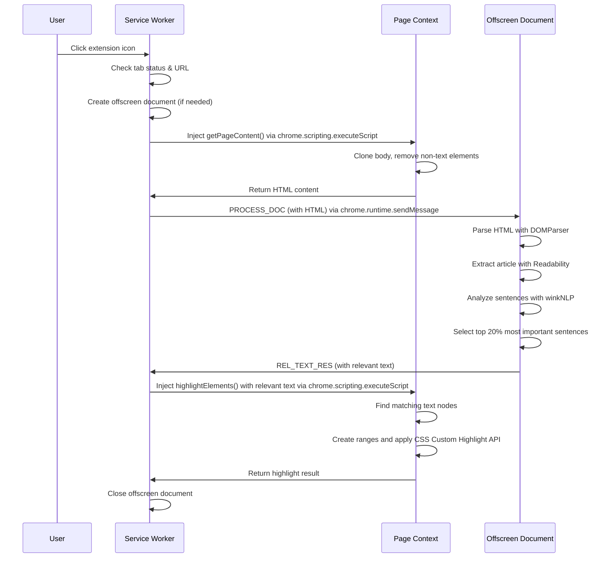

# Page Highlight

A Chrome extension that highlights the most important text sections on a webpage using NLP analysis. When you click the extension icon, it extracts the main content, identifies the top 20% most important sentences using natural language processing, and highlights them using the CSS Custom Highlight API.

## Running this extension

1. Clone this repository
2. Install dependencies: `npm install`
3. Build the extension: `npm run build`
4. Load the `dist` directory in Chrome as an [unpacked extension](https://developer.chrome.com/docs/extensions/mv3/getstarted/development-basics/#load-unpacked)
5. Navigate to any page (URLs starting with `chrome://` are not supported)
6. Click the extension icon to highlight important text sections

## Sequence Diagram

