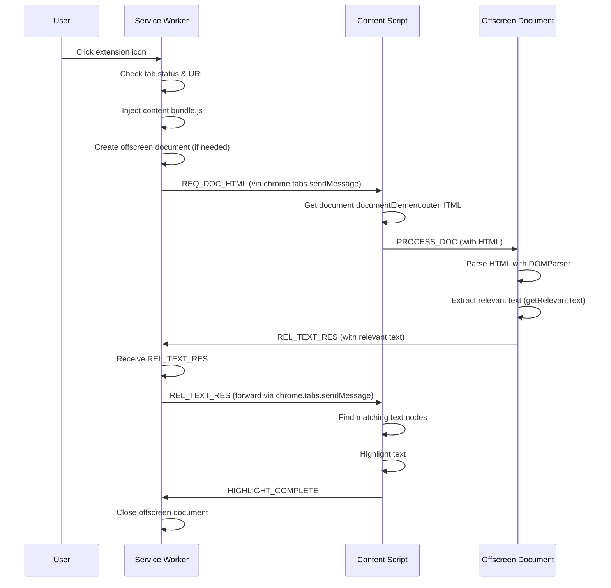

# Page Highlight

This extension changes the background color of text sections in the active tab page when the extension icon is clicked.

## Running this extension

1. Clone this repository.
2. Install dependencies `npm install`
3. Build the extension `npm run build`
4. Load the `dist` directory in Chrome as an [unpacked extension](https://developer.chrome.com/docs/extensions/mv3/getstarted/development-basics/#load-unpacked).
5. Navigate to any page (make sure that the URL doesn't start with `chrome://`).
6. Click the extension icon. The text sections will be highlighted.

## Sequence Diagram

